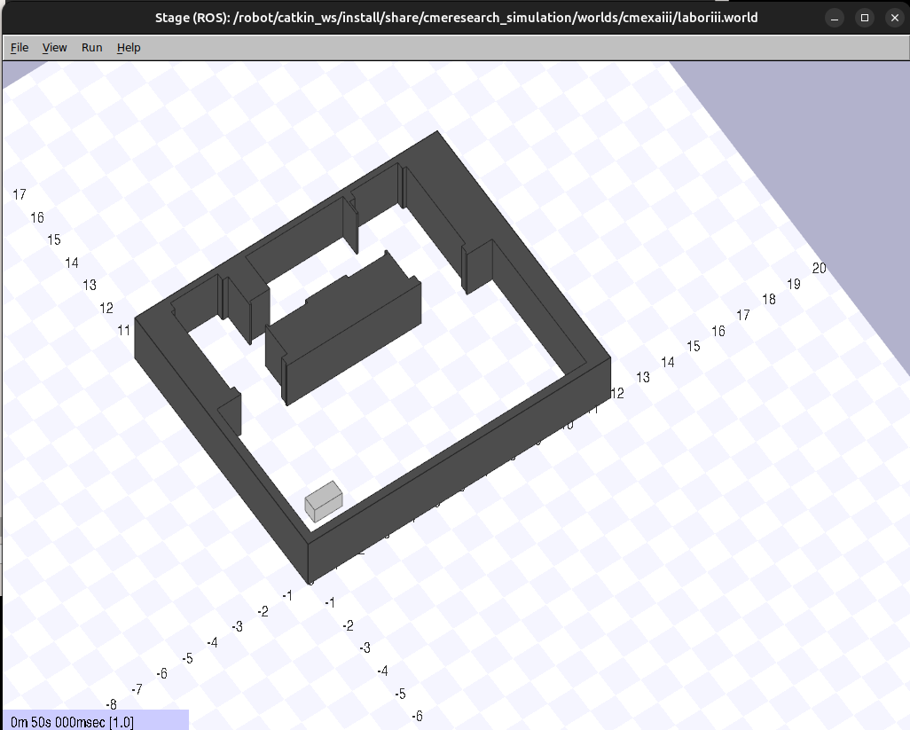
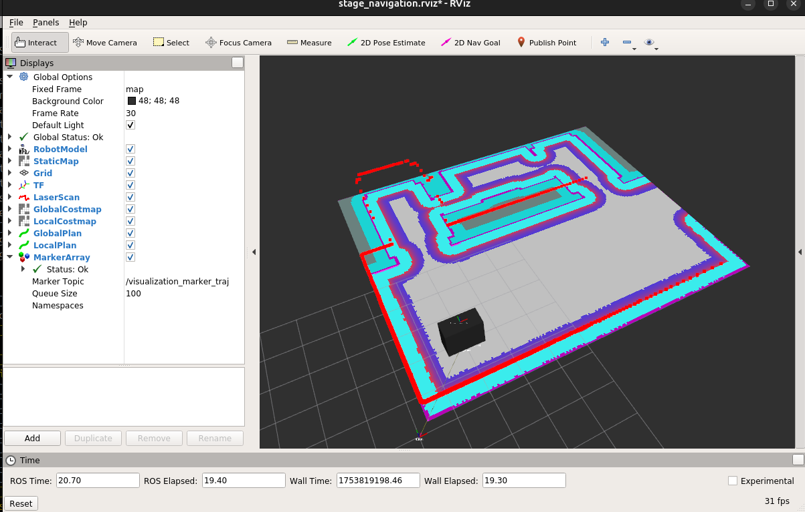

# CME Research Bringup

A comprehensive ROS package for robot control, navigation, and simulation with support for multiple robot platforms.

### What is this repository for? ###

The `cmeresearch_bringup` package provides launch files, configuration parameters, and Docker environments for operating various robot platforms developed by CME Research. It includes functionality for:

- Robot control and teleoperation
- Navigation and mapping
- SLAM (Simultaneous Localization and Mapping)
- Simulation using Stage
- Integration with various sensors and actuators
- MQTT bridge for communication

* Maintainer: Christian Ehrmann
* Version: net yet released
* License: GPLv3


# ROS Distro Support #


|         |                                         melodic                                          |      noetic      |                                         rolling                                          |
|:-------:|:----------------------------------------------------------------------------------------:|:----------------:|:----------------------------------------------------------------------------------------:|
| Branch  | [`melodic_dev`](https://bitbucket.org/cme-robotics/cmeresearch_bringup/src/melodic_dev/) |                  | [`rolling_dev`](https://bitbucket.org/cme-robotics/cmeresearch_bringup/src/rolling_dev/) |
| Status  |                                        supported                                         |  not supported   |                                        supported                                         |
| Version |                                     no yet released                                      | not yet released |                                     not yet released                                     |


## Supported Robots

This package supports the following robot platforms:

### ASH (deprecated)
A mobile robot platform with differential drive system, equipped with sensors for navigation and mapping.

### CMEXA
A mobile robot platform with omni-directional drive system. A more advanced robot platform with enhanced navigation capabilities and sensor suite.

### CMEXAIII

The CMEXA robot platform with some project specific adaptions.


### Unico Mini
A compact robot platform designed for indoor environments.

## Setup and Usage

### Prerequisites

- Ubuntu >18
- Docker engine for running containers
  - Important note: Hardware access will not work with docker desktop!
- For simulation only:
  - NVIDIA graphics adapter that runs opengl:1.0-glvnd-runtime

### Basic Usage

1. Clone this repository into your ROS workspace:
   ```
   cd ~/ros_ws/src
   git clone https://github.com/cmeresearch/cmeresearch_bringup.git
   ```

2. Build the workspace:
   ```
   cd ~/ros_ws
   colcon build
   ```

3. Source the workspace:
   ```
   source ~/ros_ws/install/setup.bash
   ```

4. Launch a robot (replace `<robot_name>` with ash, cmexa, cmexaiii or unicomini):
   ```
   export ROBOT=<robot_name>
   export ROBOT_ENV=<environment_name>
   roslaunch cmeresearch_bringup robot.launch
   ```

5. For simulation:
   ```
   roslaunch cmeresearch_bringup sim_mapping.launch
   ```

### Using vcs to clone all relevant repositories into your workspace


## For CMEXA robot

1. Create a workspace folder

````
    mkdir ros_ws/src/
````


2. Install package for multi repo version control

````
sudo apt update
sudo apt install python3-vcstools
````

on raspberry pi you need to create a virtual environment and install it via pip

````
    python3 -m venv myvenv
    source myvenv/bin/activate
    pip install vcstool
````


3. Clone cmeresearch_bringup repo:


````
    git clone https://cme-research@bitbucket.org/cme-robotics/cmeresearch_bringup.git
````

4. Call vcs from root of your workspace:


````
vcs import --input src/cmeresearch_bringup/install/cmexa_robot.repos src/
````

5. to update the repositories call vcs from root of your workspace:

```
vcs pull
```

### How to setup a new robot (raspberry pi 5)

# create a bootable microSD Card wir raspi config.

Important: Predefine Wireless LAN!!

Predefine LAN Adapter for service and commissining to

subnet mask: 255.255.255.0
ip: 192.168.1.100

Install docker:

# Add Docker's official GPG key:
sudo apt-get update
sudo apt-get install ca-certificates curl
sudo install -m 0755 -d /etc/apt/keyrings
sudo curl -fsSL https://download.docker.com/linux/debian/gpg -o /etc/apt/keyrings/docker.asc
sudo chmod a+r /etc/apt/keyrings/docker.asc

# Add the repository to Apt sources:
echo \
  "deb [arch=$(dpkg --print-architecture) signed-by=/etc/apt/keyrings/docker.asc] https://download.docker.com/linux/debian \
  $(. /etc/os-release && echo "$VERSION_CODENAME") stable" | \
  sudo tee /etc/apt/sources.list.d/docker.list > /dev/null
sudo apt-get update

---

sudo apt-get install docker-ce docker-ce-cli containerd.io docker-buildx-plugin docker-compose-plugin

---


sudo groupadd docker

sudo usermod -aG docker $USER


---

test:

docker run hello-world

---


### Using Docker Simulation for CMEXAIII

Each Docker environment has its own build and run scripts.
There might be multiple packages be required for the build!

1. Create a workspace folder

````
    mkdir ros_ws/src/
````

2. Clone the following repositories to the src/ folder:

````
    git clone https://cme-research@bitbucket.org/cme-robotics/cmeresearch_bringup.git
````
````
    git clone https://cme-research@bitbucket.org/cme-robotics/cmeresearch_description.git
````
````
    git clone https://cme-research@bitbucket.org/cme-robotics/cmeresearch_environments.git
````
````
    git clone https://cme-research@bitbucket.org/cme-robotics/cmeresearch_simulation.git
````

3. Build all in one docker images for cmexaiii from root of your workspace:


   ```
   cd ros_ws/
   bash src/cmeresearch_bringup/docker/stage_cmexa_full/build.sh
   ```

4. To allow access to the display for the docker container you need to run


````
    xhost +si:localuser:root
````

once in every terminal you want to start the container.

5. Run all in one docker container:


   ```
   bash src/cmeresearch_bringup/docker/stage_cmexa_full/run.sh
   ```


6. To connect to the running container (optional):

````
    docker exec -it <container-name> bash
````

> **Note:** The container will also start a mosquito mqtt broker. If you already run a broker on your host system the second broker will fail and show some warnings you can ignore.


### Simulation with Stage ###

The simulation comes with a 2D physical simulation of an office environment. A mqtt broker is included.
To move the robot you have to send the following Twist message to the mqtt topic "command" to drive forward.




#### commands

Send to mqtt topic

````
    vel_command
````

the following structure as json will move the robot. Only a set of frequent velocity command produce a continous movement.

    {
        "linear":
        {
            "y": 0,
            "x": 1,
            "z": 0
        },
        "angular":
        {
            "y": 0,
            "x": 0,
            "z": 0
        }
    }


See the ROS message definition for further explanation:

https://docs.ros.org/en/noetic/api/geometry_msgs/html/msg/Twist.html


Send to mqtt topic

````
    pose_goal
````


to send the robot to a specifc position and orientation relative to the robot internal map of the environment.

> **Note:** Orientation is defined in quaternions!


    {
     "header": {
       "stamp": {
         "secs": 15,
         "nsecs": 0
       },
       "frame_id": "map",
       "seq": 1
     },
     "pose": {
       "position": {
         "y": 2.3821182250976562,
         "x": 6.572987079620361,
         "z": 0
       },
       "orientation": {
         "y": 0,
         "x": 0,
         "z": -0.011110923733532866,
         "w": 0.9999382717817074
       }
     }
    }


See the ros message definition of PoseStamped for further information:

https://docs.ros.org/en/noetic/api/geometry_msgs/html/msg/PoseStamped.html

#### Use RVIZ to control the robot ####



Click on the button 2D Nav Goal and then click and orient the arrow in the middle of the map (free grey space) to send a valid navigation goal.


#### Running on Windows (not recommended, not tested!) ####

To run the Stage simulation with RViz on Windows, use the Docker configuration in `docker/stage_windows/`.
See the [Windows-specific README](docker/stage_windows/README.md) for detailed instructions.

    # Build the Docker image (from workspace root)
    ./unico_bringup/docker/stage_windows/build.sh

    # Run the container
    ./unico_bringup/docker/stage_windows/run.sh

## Brickd ##

Brickd as dependencies for tinkerforge bricklets can't be integrated in the ros melodic (ubuntu 18) docker file because
of incompatible libraries. The legacy version don't support the new hardware.
Creating another docker file for brickd runnning with ubuntu24.

To access the hardware the docker container has to be run with privileged attribute for HAT Brick

    docker run -it --network="host"  --privileged --device-cgroup-rule='c 189:* rmw' -v /dev/bus/usb:/dev/bus/usb unico/brickd:1.0

and without (but with usb device sharing) for normal bricks

    docker run -it --network="host" --device-cgroup-rule='c 189:* rmw' -v /dev/bus/usb:/dev/bus/usb unico/any:1.0


To install the autostart scripts:

    copy script "unicoautostart" to /usr/local/bin
    copy the unicoupstart file to /etc/systemd/system/unicoupstart.service

To use rviz from docker container an any ubuntu version use the docker file under docker/rviz/.


after every ubuntu startup on host machine!

TODO: Added udev rules for joystick. Perhaps they are not necessary and should be removed again.

See /etc/udev/rules.d/99-joystick.rules

with content:

````
KERNEL=="js[0-9]*", MODE="0666"
````

and trigger:

````
   sudo udevadm control --reload-rules
   sudo udevadm trigger
````

To fix on ubuntu 22?
Some times the device is added as folder /dev/input/js0 and not linked correctly.

Workaround:
````
sudo rm -rf /dev/input/js0
````

replug the joystick dongle.

#### Installation instructions for raspberry pi 5 ####

Remember to either add a ssh-key to the pi for your computer or enable password authentication und

```

/etc/ssh/sshd_config

```

### Connect to raspberry via ssvnc


Via ssh on the raspi make sure that sudo raspi-config vnc is enabled in the settings!


````

sudo apt install ssvnc

````

Connect to the raspi via ip address, user and password.


## Contact

For more information, please contact:
- Email: info@cme-robotics.com
- Website: https://cme-robotics.com